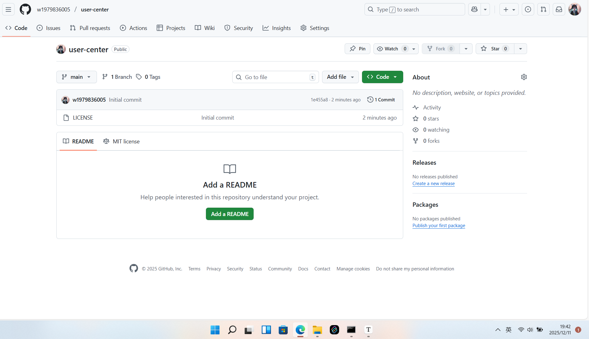
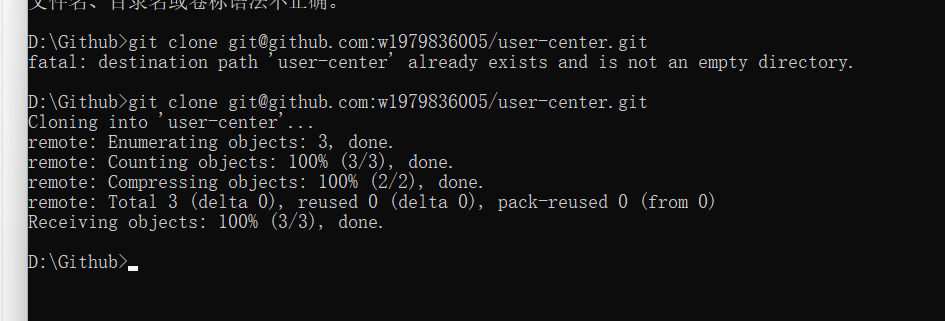
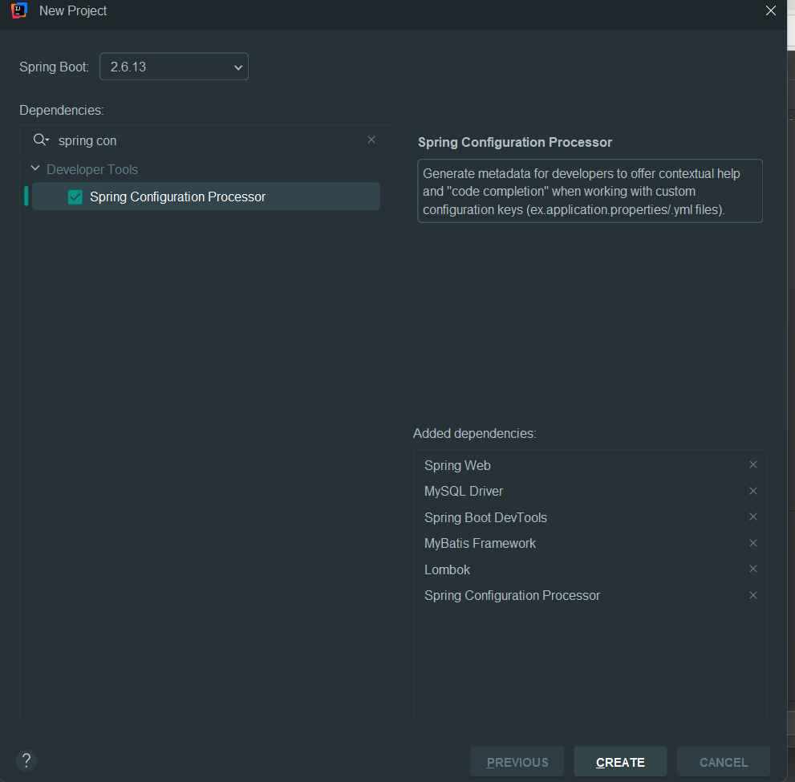

用户中心笔记

## 初始化 git 仓库

1. 在 github 上新建一个仓库

   

2. 本地远程仓库关联

   

这里注意，使用 ssh 的方式， 如果不知道 ssh 是啥的同学可以搜索查看

任何一个系统，都有用户系统，学习完当前项目，那么其余的管理系统项目都是一样的，**crud**

## 企业做项目流程

需求分析 =》 设计（概要设计、详细设计）=》 技术选型 =》初始化/引入需要的技术 =》写demo =》 写代码（实现业务逻辑） =》测试（单元测试，测试之后再上线） =》代码提交 =》代码评审  =》 部署 =》 发布

## 需求分析

不同的系统，可以公用一套用户系统

1. 用户注册
2. 用户管理（仅管理员可见） 
3. 用户校验

## 技术选型

前端： 三件套 vue + ant design

后端： java + spring + springMvc + mybatis-plus + springboot + mysql

部署： 服务器docker

## 后端初始化

使用 idea 的 springboot init 项目初始化工具

