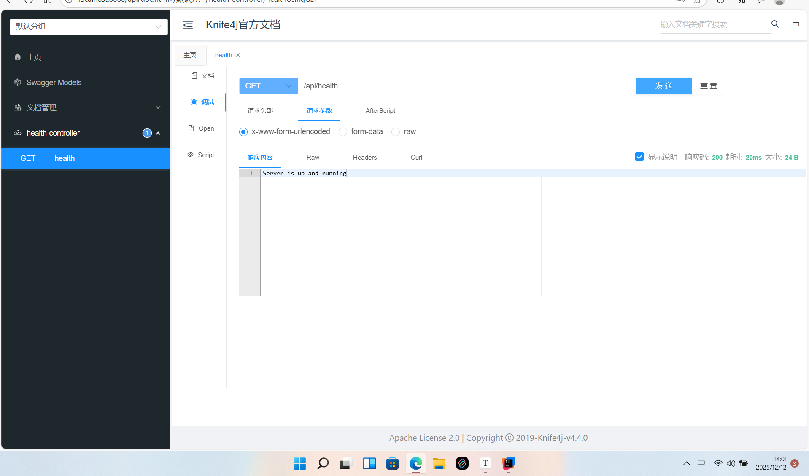

用户中心笔记

## 初始化 git 仓库

1. 在 github 上新建一个仓库

   


2. 本地远程仓库关联

   

这里注意，使用 ssh 的方式， 如果不知道 ssh 是啥的同学可以搜索查看


任何一个系统，都有用户系统，学习完当前项目，那么其余的管理系统项目都是一样的，**crud**


## 企业做项目流程


需求分析 =》 设计（概要设计、详细设计）=》 技术选型 =》初始化/引入需要的技术 =》写demo =》 写代码（实现业务逻辑） =》测试（单元测试，测试之后再上线） =》代码提交 =》代码评审  =》 部署 =》 发布


## 需求分析

不同的系统，可以公用一套用户系统

1. 用户注册
2. 用户管理（仅管理员可见） 
3. 用户校验


## 技术选型


前端： 三件套 vue + ant design

后端： java + spring + springMvc + mybatis-plus + springboot + mysql

部署： 服务器docker


## 后端初始化

使用 idea 的 springboot init 项目初始化工具


修改配置文件  application.yml

```yml
server:
  port: 8080
# 数据库配置
spring:
  datasource:
    # 数据库连接 URL
    # 请将 your_database_name 替换为你的数据库名
    # serverTimezone=Asia/Shanghai 是为了避免时区问题
    url: jdbc:mysql://localhost:3306/user_center
    # 数据库用户名 (请替换)
    username: root
    # 数据库密码 (请替换)
    password: 123456
    # 数据库驱动类 (推荐使用 MySQL 8.x 版本的驱动)
    driver-class-name: com.mysql.cj.jdbc.Driver
```


配置好数据库


## 引入 mybatis-plus

加入当前依赖的坐标

```xml
<dependency>
    <groupId>com.baomidou</groupId>
    <artifactId>mybatis-plus-boot-starter</artifactId>
    <version>3.5.15</version>
</dependency>
```

去除掉mybatis的依赖坐标，重复了

```xml
<!--        <dependency>-->
<!--            <groupId>org.mybatis.spring.boot</groupId>-->
<!--            <artifactId>mybatis-spring-boot-starter</artifactId>-->
<!--            <version>2.2.2</version>-->
<!--        </dependency>-->
```


## 引入 kni4fj 接口文档

pox.xml

```xml
<!--      knife4j  https://doc.xiaominfo.com/docs/quick-start-->
        <dependency>
            <groupId>com.github.xiaoymin</groupId>
            <artifactId>knife4j-openapi2-spring-boot-starter</artifactId>
            <version>4.4.0</version>
        </dependency>
```

application.yml

```yml
knife4j:
  enable: true
  openapi:
    title: Knife4j官方文档
    description: "`我是测试`,**你知道吗**
    # aaa"
    email: xiaoymin@foxmail.com
    concat: 八一菜刀
    version: v1.0
    group:
      test1:
        group-name: 默认分组
        api-rule: package
        api-rule-resources:
          - com.gaoqiao.usercenterbacked.controller
```


给项目加上访问前缀

```yml
server:
  port: 8080
  servlet:
    context-path: /api
```


完整的 application.yml

```yml
server:
  port: 8080
  servlet:
    context-path: /api
# 数据库配置
spring:
  application:
    name: user-center
  datasource:
    # 数据库连接 URL
    # 请将 your_database_name 替换为你的数据库名
    # serverTimezone=Asia/Shanghai 是为了避免时区问题
    url: jdbc:mysql://localhost:3306/user_center
    # 数据库用户名 (请替换)
    username: root
    # 数据库密码 (请替换)
    password: 123456
    # 数据库驱动类 (推荐使用 MySQL 8.x 版本的驱动)
    driver-class-name: com.mysql.cj.jdbc.Driver

knife4j:
  enable: true
  openapi:
    title: Knife4j官方文档
    description: "`我是测试`,**你知道吗**
    # aaa"
    email: xiaoymin@foxmail.com
    concat: 八一菜刀
    version: v1.0
    group:
      test1:
        group-name: 默认分组
        api-rule: package
        api-rule-resources:
          - com.gaoqiao.usercenterbacked.controller
```


## 新建测试接口

```java
package com.gaoqiao.usercenterbacked.controller;

import org.springframework.web.bind.annotation.GetMapping;
import org.springframework.web.bind.annotation.RequestMapping;
import org.springframework.web.bind.annotation.RestController;

@RestController
@RequestMapping("/")
public class HealthController {

    @GetMapping("/health")
    public String health() {
        return "Server is up and running";
    }
}

```


尝试通过接口文档来访问



## 数据库设计


用户表： user

id 主键 bigint

username 用户名 varchar

avatarUrl 用户头像 varchar

gender 性别 tinyint  0 -女 1-男

password 密码 varchar

phone 电话号码 varchar

email 电子邮件 varchar

isValid 是否有效-是否被封号 tinyint


isDelete 是否被删除

updateTime 更新时间

createTime 创建时间


```mysql
CREATE TABLE `user` (
  `id` BIGINT NOT NULL AUTO_INCREMENT COMMENT '用户ID，主键',
  `username` VARCHAR(50) NOT NULL COMMENT '用户名',
  `avatarUrl` VARCHAR(255) DEFAULT NULL COMMENT '用户头像URL',
  `gender` TINYINT DEFAULT 0 COMMENT '性别：0-女, 1-男',
  `password` VARCHAR(255) NOT NULL COMMENT '密码（加密存储）',
  `phone` VARCHAR(20) DEFAULT NULL COMMENT '电话号码',
  `email` VARCHAR(100) DEFAULT NULL COMMENT '电子邮件',
  `isValid` TINYINT DEFAULT 1 COMMENT '是否有效：0-封禁, 1-正常',
  `isDelete` TINYINT DEFAULT 0 COMMENT '是否删除：0-未删除, 1-已删除（逻辑删除）',
  `createTime` DATETIME DEFAULT CURRENT_TIMESTAMP COMMENT '创建时间',
  `updateTime` TIMESTAMP DEFAULT CURRENT_TIMESTAMP ON UPDATE CURRENT_TIMESTAMP COMMENT '更新时间',
  PRIMARY KEY (`id`),
  UNIQUE KEY `uk_username` (`username`),
  UNIQUE KEY `uk_phone` (`phone`),
  UNIQUE KEY `uk_email` (`email`)
) ENGINE=InnoDB DEFAULT CHARSET=utf8mb4 COMMENT='用户表';

```

在数据库中新建当前用户表，使用 mybatisx生成基础的 crud 代码


添加 mapperScan 扫描 mapper 包 

```java
@MapperScan("com.gaoqiao.usercenterbacked.mapper")
```